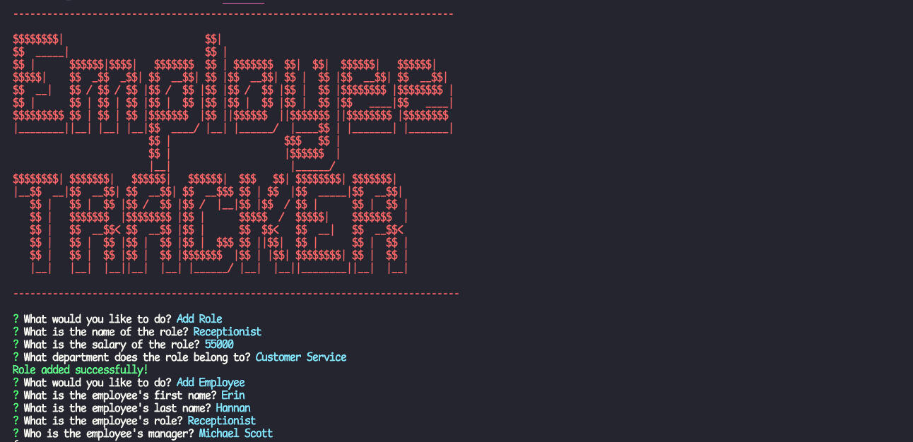
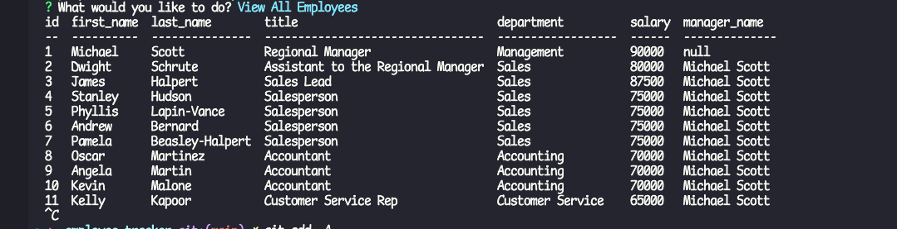

# employee-tracker
 

## Description

This application is a content management system that allows 
managers to easily keep track of their employees. By using the command line interface, you
can view all the organization's employees, job roles, and departments. You can also add 
employees, add new roles, add new departments, and update current employees.

## Table of Contents

  - [Installation](#installation)
  - [Usage](#usage)
  - [License](#license)
  - [Questions](#questions)

## Installation 

This app uses the following:
  
chalk, console.table, inquirer, mysql2

## Usage

Video Walk Through:

https://drive.google.com/file/d/1DscMYjKd5kA2EmoRsfvhVHXPpMlRNt6z/view

## License

This application uses the MIT license.
  
MIT: https://choosealicense.com/licenses/mit/

## Questions

If you have any questions about the repo, open an issue or 
contact me directly at ryanmbelcher86@gmail.com. You can find more of my work at 
https://github.com/ryanmbelcher.

